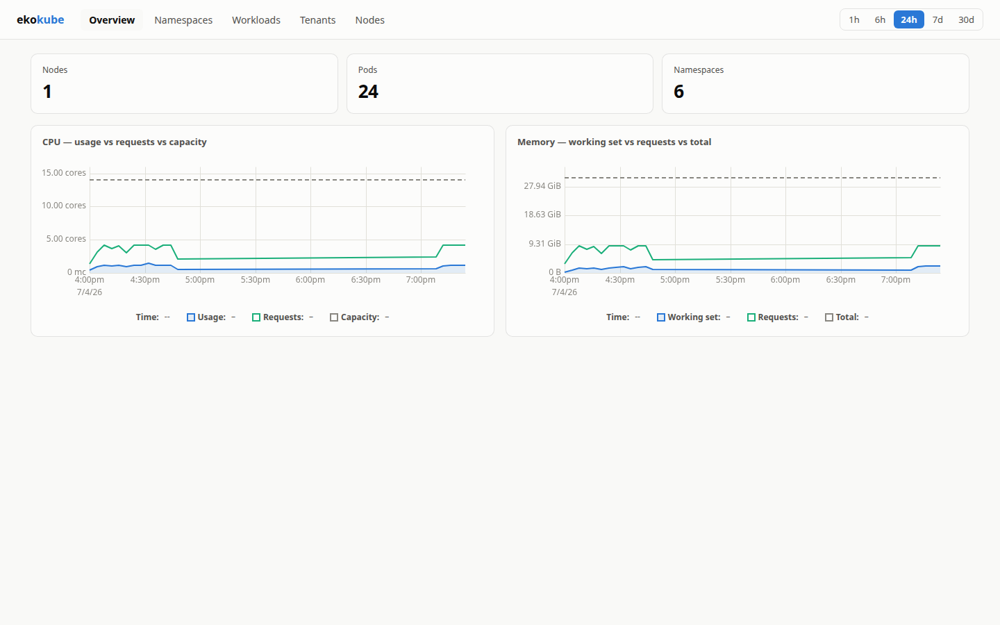
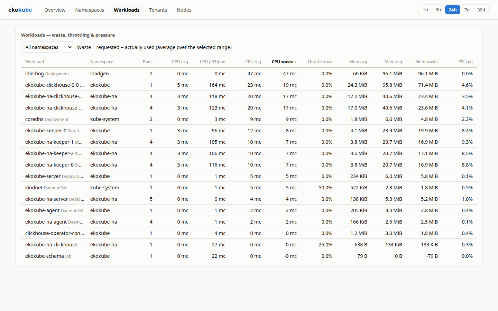

# ekokube

[](https://github.com/nahuel11500/ekokube/actions/workflows/ci.yaml)
[](LICENSE)

Kubernetes resource analytics: **real** CPU/RAM usage vs **requests/limits**,
per pod / workload / namespace / node — stored in ClickHouse, explored through a
purpose-built UI. Answers, out of the box:

- What does each namespace actually consume?
- Which workloads waste CPU/RAM (requested ≫ used)? Which are throttled or under memory pressure?
- What did each **tenant** consume over a period (chargeback / refacturation), with CSV export?
- (roadmap) What are our CO2 emissions?




> **Status: early.** The pipeline is tested end-to-end (unit, smoke, kind e2e,
> 144M-row query benchmarks), but the project is young — expect rough edges and
> schema evolution before v1.

## Requirements

- Kubernetes ≥ 1.28, nodes running **cgroup v2** (a deliberate scope choice —
  cgroup v1 is not supported).
- The [official ClickHouse operator](https://github.com/ClickHouse/clickhouse-operator)
  (installed by `deploy/install.sh`, or bring your own ClickHouse).

## Architecture

```
┌─ every node ─────────────────┐
│ ekokube-agent (Rust, DS)     │──batch INSERT──▶ ┌───────────────┐    ┌──────────────────┐
│  • /sys/fs/cgroup (usage)    │                  │  ClickHouse   │◀───│ ekokube-server   │◀── Browser
│  • kubelet :10250/pods (meta)│                  │ (official op) │    │ (axum API + UI + │
└──────────────────────────────┘                  └───────────────┘    │  ns/node syncer) │
                                                                       └──────────────────┘
```

- **Agent** (DaemonSet): reads usage straight from **cgroup v2** — pod UID parsed
  from the cgroup path, ~5 file reads per pod, zero kubelet load even at 1000
  pods/node. Includes CPU throttling and PSI pressure. Pod metadata
  (requests/limits, labels, workload) comes from the node-local kubelet `/pods`
  endpoint — **no API-server traffic in the data path**. Each sample carries
  `sample_secs`, so all aggregates are exact resource-seconds.
- **ClickHouse**: raw samples (14d TTL) roll up into hourly (400d) and daily
  (1100d) `AggregatingMergeTree` tables via materialized views. All long-range
  queries hit rollups.
- **Server + UI**: axum API compiles queries against the rollups; a small
  syncer mirrors namespace/node labels + allocatable into dimension tables
  (the only API-server consumer). React UI with canvas charts (uPlot) and
  virtualized tables — built for clusters with 100k+ pod series.
- **Tenancy is a query-time rule set** (namespace, namespace-label or pod-label
  based), editable in the UI with live preview — rule changes apply
  **retroactively** to all history. Chargeback shows both reserved
  (request-based) and used cost, exportable as CSV.

## Repository layout

```
agent/     Rust DaemonSet collector
server/    Rust axum API + metadata syncer + tenant rules engine
common/    shared quantity parsing
ui/        React + Vite + TS frontend (uPlot, TanStack Virtual)
deploy/
  schema/      ClickHouse DDL (also embedded in the Helm chart)
  helm/ekokube Helm chart (agent DS, server, RBAC, schema migration job)
  clickhouse/  example ClickHouseCluster/KeeperCluster (official operator)
dev/       docker-compose ClickHouse, dev DaemonSet, load generator
```

## Local development

```bash
# 1. ClickHouse with schema auto-applied
docker compose -f dev/docker-compose.yaml up -d

# 2. API server (kubernetes syncer off outside a cluster)
EKOKUBE_SYNC_ENABLED=false cargo run -p ekokube-server

# 3. UI with /api proxy
cd ui && npm install && npm run dev
```

Run the agent locally against any cgroup v2 tree by pointing
`EKOKUBE_CGROUP_ROOT` and `EKOKUBE_KUBELET_URL` at fakes (see `agent/src/cgroup.rs` tests).

## Deploying

Deployed as **two Helm releases**: the ClickHouse operator, then ekokube (agent,
server/UI, `ClickHouseCluster`+`KeeperCluster` CRs, schema). Two releases is
required, not incidental — Helm validates a release against the API server up
front, so a `ClickHouseCluster` CR cannot live in the same release as the CRDs
that define it. The operator release establishes the CRDs; the ekokube release's
CR then validates. No cert-manager needed (the operator's admission webhook only
validates CRs we generate ourselves, so it's disabled).

Images are published to GitHub Container Registry on every release:
`ghcr.io/nahuel11500/ekokube-agent` and `ghcr.io/nahuel11500/ekokube-server`
(the chart defaults point there — no local build needed).

```bash
# One command runs both releases (operator, wait for CRDs, then ekokube):
deploy/install.sh -n ekokube --set clickhouse.auth.password='change-me'
# HA (2 ClickHouse + 3 Keepers):  deploy/install.sh -n ekokube --ha
# Operator already installed cluster-wide? Skip it:
deploy/install.sh -n ekokube --skip-operator --set clickhouse.auth.password='change-me'
```

The operator is a separate, cluster-wide release, so the ekokube chart never
installs it. **If the operator already runs in the cluster, just install the
ekokube release directly** (no operator step needed):

```bash
helm install ekokube deploy/helm/ekokube -n ekokube --set clickhouse.auth.password='change-me'
```

Otherwise install the operator first, then ekokube:

```bash
helm install clickhouse-operator oci://ghcr.io/clickhouse/clickhouse-operator-helm \
  --version 0.0.6 -n ekokube --create-namespace \
  --set webhook.enabled=false --set certManager.enabled=false --set metrics.secure=false --wait
kubectl wait --for=condition=Established crd/clickhouseclusters.clickhouse.com crd/keeperclusters.clickhouse.com
helm install ekokube deploy/helm/ekokube -n ekokube --set clickhouse.auth.password='change-me'
```

Key values (ekokube release):

| Value | Default | |
|---|---|---|
| `clickhouse.ha` | `false` | `true` → 2 ClickHouse replicas + 3 Keepers, schema database created with the `Replicated` engine so all data is on every replica |
| `clickhouse.image.tag` | `25.8` | pinned ClickHouse (LTS line); the operator otherwise defaults to `:latest` (a pre-release) |
| `clickhouse.managed` | `true` | set `false` to bring your own ClickHouse (`clickhouse.host` etc.) |
| `clickhouse.auth.password` | `ekokube` | **change it**, or use `clickhouse.auth.existingSecret` + `passwordSha256` |
| `server.auth.enabled` | `true` | HTTP Basic Auth on the UI + API (browser login) |
| `server.auth.username` / `.password` | `admin` / `ekokube` | **change the password**, or set `server.auth.existingSecret` (a Secret with a `password` key). `/api/health`, `/api/health/ready`, `/metrics` stay open for probes and scraping |
| `clickhouse.resources` | 2Gi | ClickHouse container resources (the operator's 512Mi default is too small to query) |
| `clickhouse.storage` | `200Gi` | size for the retention (raw 14d, hourly 400d, daily 1100d) |
| `server.ingress.enabled` | `false` | expose the UI |
| `monitoring.serviceMonitor.enabled` | `false` | PodMonitor (agent) + ServiceMonitor (server) for prometheus-operator |

The agent exposes Prometheus metrics on `:9090/metrics` (cycle duration, rows
written, insert failures, outage-buffer depth/drops); the server on
`/metrics`. During a ClickHouse outage the agent buffers samples in memory
(`agent.bufferMaxRows`, default 250k rows) and backfills on recovery.

Notes:
- `deploy/helm/ekokube/schema/` is a copy of `deploy/schema/` (Helm can't
  reference files outside the chart) — CI checks they stay in sync.
- The operator chart keeps its CRDs on uninstall (`crd.keep: true`). To fully
  reset, `helm uninstall ekokube clickhouse-operator -n ekokube` then delete the
  `clickhousecluster`/`keepercluster` CRs and, if desired, the CRDs.

## Testing

- `dev/smoke-test.sh` — full agent pipeline against a fake cgroup tree, fake
  kubelet and a real ClickHouse (no Kubernetes needed). Runs in CI.
- `dev/e2e-kind.sh [--ha] [--skip-build]` — installs the chart on a kind
  cluster and asserts collected data (throttling, waste ranking, tenancy).
- `dev/perf-check.sh` — seeds 200k pod series × 30 days of hourly rollups
  (144M rows) and requires the table/chart endpoints to answer warm in <500ms.

## Configuration (env)

| Variable | Component | Default | |
|---|---|---|---|
| `EKOKUBE_CLICKHOUSE_URL` | both | `http://localhost:8123` | HTTP endpoint |
| `EKOKUBE_CLICKHOUSE_DATABASE/USER/PASSWORD` | both | `ekokube`/`default`/`` | |
| `EKOKUBE_INTERVAL_SECS` | agent | `15` | usage scrape interval |
| `EKOKUBE_META_INTERVAL_SECS` | agent | `30` | kubelet /pods refresh |
| `EKOKUBE_CGROUP_ROOT` | agent | `/sys/fs/cgroup` | |
| `EKOKUBE_KUBELET_URL` | agent | `https://127.0.0.1:10250` | |
| `EKOKUBE_KUBELET_INSECURE_TLS` | agent | `true` | kubelet serving certs are typically self-signed |
| `EKOKUBE_METRICS_ADDR` | agent | `0.0.0.0:9090` | Prometheus endpoint |
| `EKOKUBE_BUFFER_MAX_ROWS` | agent | `250000` | outage buffer cap (drop-oldest) |
| `EKOKUBE_LISTEN_ADDR` | server | `0.0.0.0:8080` | |
| `EKOKUBE_SYNC_ENABLED` | server | `true` | namespace/node syncer |
| `EKOKUBE_STATIC_DIR` | server | `./static` | built UI location |
| `EKOKUBE_AUTH_USERNAME/PASSWORD` | server | unset | enables HTTP Basic Auth when the username is set |

## Contributing

Issues and PRs welcome. `cargo fmt && cargo clippy --all-targets && cargo test`
plus `dev/smoke-test.sh` should pass; CI runs the same checks.

- **Conventional commits** are required (`feat:`, `fix:`, `chore:`, …) and
  linted in CI (commitlint).
- **Releases are automated** with release-please: merging the release PR bumps
  Cargo.toml / Chart.yaml / image tags, updates the CHANGELOG, tags `vX.Y.Z`,
  and the release workflow publishes matching images to ghcr.
- **Dependencies** are kept fresh by Renovate (grouped non-major PRs).

## License

[Apache-2.0](LICENSE)

## Roadmap

- CO2: measured power via RAPL (`/sys/class/powercap`) on bare metal, Cloud
  Carbon Footprint coefficients as fallback, attributed to pods by CPU share.
- Container-level granularity behind a flag.
- Multi-shard ClickHouse layout for very large fleets.
